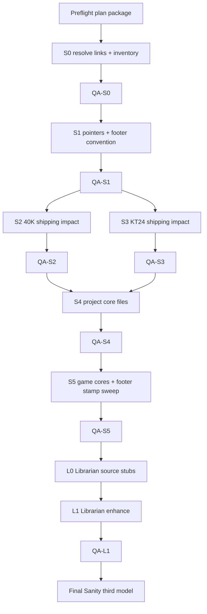

<!--
FILE: docs/handoffs/dataslate_0826/track_in.md
VERSION: v0.1 (2026-08-27)
OWNER: Russell Catt
AUTHOR_OF_NOTES: Cursor (Coordinator — plan package)

DOCUMENT_TYPE: Track hand-off in
PROJECT_NAME: Wargame_Concierge
TRACK: dataslate_0826
STATUS: Open — plan package Ready; execution gated on Preflight link resolve + user auth
-->

# Track in — dataslate_0826

- **Project:** Wargame_Concierge
- **Track:** `dataslate_0826`
- **Status:** Open — plan package on branch `feature/dataslate_0826` (2026-08-27); **execution gated** until Preflight resolves WarCom links + user authorizes
- **Branch:** `feature/dataslate_0826` (user-requested name)
- **Handoffs root:** `docs/handoffs/dataslate_0826/`
- **Playbook:** [`docs/operations/multiagent_coordinator_strategy.md`](../../operations/multiagent_coordinator_strategy.md)
- **QA skill:** [`.cursor/skills/qa-slice/SKILL.md`](../../../.cursor/skills/qa-slice/SKILL.md)
- **Librarian enhance:** [`.cursor/skills/librarian-enhance/SKILL.md`](../../../.cursor/skills/librarian-enhance/SKILL.md)

## Goals

1. **Parse** the three owner WarCom newsletter links → canonical article URLs, titles, **dataslate effective dates**, free PDF filenames, and which systems they touch (40K / Kill Team / both).
2. **Pointer + inventory** only under `raw/pointers/` (and living-source tables) — **never** commit GW dataslate PDFs/binaries.
3. **Shipping impact pass** for **Warhammer 40,000 11e** and **Kill Team 2024**: update teaching docs where points, rules, or team packages changed; teaching paraphrase; Codex wall intact on 40K armies.
4. **Core currency pass:** project root + `docs/` core files, and **each game’s core files** (`games/warhammer_40k_11e/`, `games/kill_team_2024/`, `games/the_warcode/` — Warcode marks N/A for GW dataslate but still gets a “last reviewed” stamp).
5. **Footer freshness:** every touched GW footer / Games Workshop notice / print footer notes the **dataslate date** (locked convention below).
6. **Heavy QA:** Tier 2 after every shipping/Librarian slice; Implementer model ≠ QA model; Final Sanity uses a **third** model family; FS performs **legibility spot-checks** on changed pages.

## Non-goals

- Dumping dataslate / MFM / Faction Pack / team PDF text into git.
- Rewriting Warcode rules for GW balance (out of product scope).
- Closing parked KT follow-ups (`kt24_doc_followups`) unless a dataslate item forces a touch.
- Merging to `main` without user gate (squash via PR).

## Owner input links (locked — resolve in S0)

| # | Newsletter / tracking URL (resolve → canonical) |
|---|--------------------------------------------------|
| L1 | `https://news.warhammer.com/optiext/optiextension.dll?ID=NC2rRE5wEV0G-B16_yG7pcanGMxH-qSH65CvPRHKgk0lUOWff50iRYu-XhL1wJ4S_HDtJMcWHz1nXsFwaT8` |
| L2 | `https://news.warhammer.com/optiext/optiextension.dll?ID=oGaQ5eOApC1Q-hcypyE7zoFhMv6hgaWSzW1A3xVHSue3e3-ZPpkSIZWdipRa8LOWLH00qp_3g15zYsX_K2A` |
| L3 | `https://news.warhammer.com/optiext/optiextension.dll?ID=NTOd06r859kUenLP4iE4NYBr2beBbX0uj9BZh9WeCsuZ3BM0xvoWY9CyN_SxDE3TFE1JYgktd5TzzPIZXaw` |

**Egress note (plan session):** Cloud egress currently blocks `news.warhammer.com` / `warhammer-community.com`. Domains requested for allowlist. Until allowed (or owner pastes resolved titles/URLs/PDF names), S0 stays **Blocked**.

## Locked dates (fill in S0)

| Field | Value |
|-------|-------|
| **40K Balance Dataslate date** | _TBD — S0_ |
| **KT Balance Dataslate date** | _TBD — S0_ (may equal 40K date) |
| **Announcement retrieval date** | _TBD — S0_ |
| **Footer stamp strings** | See convention below once dates lock |

## Footer freshness convention (locked for this track)

Extend existing GW notices — **do not replace** UNOFFICIAL / non-endorsement language.

**Print HTML (append inside `.gw-ip-footer` or immediately after):**

```text
Rules currency: Balance Dataslate <YYYY-MM-DD> (WarCom). Teaching paraphrase — verify owned PDF before tournament play.
```

**Markdown shipping (`## Games Workshop notice` or Attribution):**

```text
Rules currency: Balance Dataslate <YYYY-MM-DD> (WarCom) · teaching paraphrase.
```

**Warcode / non-GW systems:**

```text
Last reviewed: <YYYY-MM-DD> · not affected by Games Workshop Balance Dataslates.
```

**Templates:** S1 updates [`templates/Footer_Template_Gw_Print.md`](../../../templates/Footer_Template_Gw_Print.md) + [`templates/Gw_Print_Banner.html`](../../../templates/Gw_Print_Banner.html) with an optional “currency line” section so future slices reuse it.

## Trust ladder

| Tier | Source | SoT for |
|------|--------|---------|
| **1** | Owned local dataslate / update PDFs under `C:\Personal\40K\rules\` and `C:\Personal\Kill Team\kill_team_2024\` (read in place) | Mechanical changes once downloaded |
| **1** | WarCom-free Core / dated `eng_*` hierarchy (existing) | Core rules still win unless dataslate explicitly patches the same topic |
| **2** | WarCom announcement articles (L1–L3 resolved) | Discovery, dates, PDF names, high-level change lists |
| **3** | Wahapedia | Cross-check only; `draft` until owned PDF |

Owned PDF wins on conflict with article paraphrase. Record conflicts in KB source pages.

## Model matrix (locked — different families)

| Role | Model | Notes |
|------|--------|-------|
| Coordinator | `inherit` | Parent; sole git after each Resolved - Complete |
| Preflight / S0 research | `composer-2.5-fast` | Link resolve + inventory tables |
| Implementer (S1–S5) | `claude-sonnet-5-thinking-high` | Shipping + templates + core files |
| Librarian (L0–L1) | `claude-sonnet-5-thinking-high` | `KB/` only; never `raw/` |
| **QA (every slice)** | `gpt-5.6-sol-high` | **Must differ from Implementer family** |
| **Final Sanity** | `gemini-3.7-flash-high` | **Third family**; legibility spot-checks |

If a listed model is unavailable in a session, pick another from the **same family constraint** (Impl ≠ QA ≠ FS). Record actual model used in each `*_implementer.md` / `*_qa.md`.

## Dependency graph



**Pipelining:** After QA1 PASS, S2 and S3 may run in parallel (separate agents). S4 waits for both QA2 and QA3. L0 may draft source stubs after S0 locks dates (even before shipping finishes) but L1 enhance waits for S2/S3/S5 content.

## Slice map

| Slice | Owner | Deliverable |
|-------|-------|-------------|
| **Preflight** | Coordinator | This package — briefs Ready |
| **S0** | Implementer | Resolve L1–L3; fill dates; PDF names; local path inventory; impact matrix (which factions/teams/docs likely change) |
| **QA-S0** | QA | Re-check URLs/dates/impact matrix vs article text |
| **S1** | Implementer | `raw/pointers/*` + living sources; footer template currency line; no binaries |
| **QA-S1** | QA | Pointer hygiene; template does not drop UNOFFICIAL requirements |
| **S2** | Implementer | 40K shipping: lists, QRs, Key Concepts, setup/rules teaching as impacted; stamp footers |
| **QA-S2** | QA | Codex wall; regression bar; legibility spot-check ≥3 changed pages |
| **S3** | Implementer | KT24 shipping: teams/rules/print as impacted; stamp footers |
| **QA-S3** | QA | Quote hierarchy; regression; legibility spot-check ≥3 pages |
| **S4** | Implementer | Project core: `README.md`, `START_HERE.md`, `AGENTS.md` living-refs touch if needed, `docs/README.md`, `docs/Project_Planning.md`, `docs/Game_System_Scaffold.md`, `games/README.md`, `raw/README.md` (pointer note only — Coordinator/Implementer may edit `raw/` markdown pointers, never binaries) |
| **QA-S4** | QA | Currency claims match S0 dates; no stale “July-only” language where dataslate supersedes |
| **S5** | Implementer | Game core READMEs + Event_Ready + rules/setup indexes for **all three** systems; sweep remaining GW footers for currency line; Warcode N/A stamp |
| **QA-S5** | QA | Footer sample audit; Warcode proper-noun ban untouched |
| **L0** | Librarian | KB source page stubs for 40K + KT dataslates |
| **L1** | Librarian | Enhance entities/glossary/index/log; or no-op waivers with reasons |
| **QA-L1** | QA | Librarian enhance checklist |
| **FS** | Final Sanity | Cross-slice rollup; open questions closed or waived; **legibility spot-checks** on a fixed sample set; track final report |

## Core file inventory (S4 / S5 must touch or explicitly waive)

### Project / docs core (S4)

| Path | Expectation |
|------|-------------|
| `README.md` | Mention latest dataslate currency or link to games READMEs |
| `START_HERE.md` | Same |
| `AGENTS.md` | Living-refs / retrieval date if dataslate joins SoT table (paraphrase only) |
| `docs/README.md` | Hand-off / currency note |
| `docs/Project_Planning.md` | Status snapshot if balance docs are now in play |
| `docs/Game_System_Scaffold.md` | Only if balance sources section needs a line |
| `docs/Rehydration_Prompt.md` | Freshness cue if it lists rules sources |
| `games/README.md` | Per-system currency line |
| `raw/README.md` | Pointer policy reminder (no binaries) |
| `reference/Source_Library.md` | Catalog rows for new dataslates (read-only patterns OK to update) |

### Game cores (S5)

| System | Paths |
|--------|-------|
| 40K 11e | `games/warhammer_40k_11e/README.md`, `rules/README.md`, `setup/README.md` (if present), army READMEs for Necrons + Space Marines |
| KT24 | `games/kill_team_2024/README.md`, `rules/README.md`, `Event_Ready.md`, priority team READMEs |
| Warcode | `games/the_warcode/README.md` (+ rules Overview if needed) — **N/A stamp only** |

## Constraints

- Never commit GW PDFs/images. Pointers only.
- Librarian never writes `raw/`. Implementer/Coordinator own pointer markdown under `raw/pointers/`.
- Never create `wiki/`. UTF-8 no BOM.
- **Codex wall** on `games/warhammer_40k_11e/armies/**`.
- KT / 40K quote exceptions unchanged (AGENTS Sec 10).
- Warcode shipping: GW proper-noun ban remains.
- Subagents **do not** `git commit` / `git push` unless user explicitly gates otherwise.
- Print HTML keeps UNOFFICIAL banner + non-endorsement footer; currency line is additive.

## Open questions (owner)

1. Confirm resolved article titles once S0 can fetch (or paste them if egress stays blocked).
2. Have the dataslate PDFs been saved under `C:\Personal\40K\rules\` and `C:\Personal\Kill Team\…` yet? If not, S2/S3 stay discovery-only (`draft`) until local files exist.
3. Authorize full track execution after Preflight/S0?

## Slice rollup

| Slice | Status |
|-------|--------|
| Preflight | Resolved - Implemented (plan package) |
| S0 | Ready — blocked on WarCom egress or owner paste |
| QA-S0 | Pending |
| S1 | Ready (depends QA-S0) |
| QA-S1 | Pending |
| S2 | Ready (depends QA-S1) |
| QA-S2 | Pending |
| S3 | Ready (depends QA-S1) |
| QA-S3 | Pending |
| S4 | Ready (depends QA-S2 + QA-S3) |
| QA-S4 | Pending |
| S5 | Ready (depends QA-S4) |
| QA-S5 | Pending |
| L0 | Ready (may start after S0 dates lock) |
| L1 | Ready (depends QA-S5) |
| QA-L1 | Pending |
| FS | Pending |

## Change Log

- v0.1 (2026-08-27): Plan package — multi-slice track, model matrix, footer currency convention, core-file inventories.
