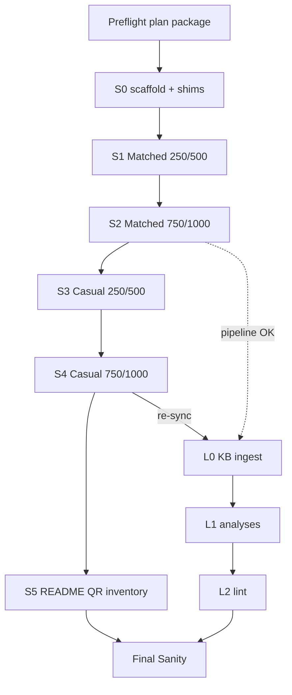

<!--
FILE: docs/handoffs/sm_matched_vs_casual/track_in.md
VERSION: v0.2 (2026-08-22)
OWNER: Russell Catt
AUTHOR_OF_NOTES: Cursor (Coordinator — plan package; execution gated)

DOCUMENT_TYPE: Track hand-off in
PROJECT_NAME: Wargame_Concierge
TRACK: sm_matched_vs_casual
STATUS: Open — Plan package complete; awaiting user authorization to execute slices
-->

# Track in — sm_matched_vs_casual

- **Project:** Wargame_Concierge
- **Track:** `sm_matched_vs_casual`
- **Status:** Open — plan package 2026-08-22; **do not execute slices until user authorizes**
- **Handoffs root:** `docs/handoffs/sm_matched_vs_casual/`
- **Playbook:** [`docs/operations/multiagent_coordinator_strategy.md`](../../operations/multiagent_coordinator_strategy.md)
- **Shipping surface:** `games/warhammer_40k_11e/armies/space_marines/`
- **KB surface:** `KB/` (Librarian only)
- **Depends on:** Servitors Legends resolution (PR #6 / branch `cursor/servitors-legends-check-b7e0` — merge or include before S3/S4 Casual)

## Goals

1. **Duplicate** Blood Ravens Gladius starter lists into two clear product lines:
   - **Matched play** — MFM + Faction Pack legal only (no Legends units costed).
   - **Casual (Legends)** — same core, plus owned Legends options (Bike Squad, Attack Bike, Astartes Servitors, and any other owned Legends called out in inventory).
2. Make the dual-path obvious from [`README.md`](../../../games/warhammer_40k_11e/armies/space_marines/README.md) and the QR so a player never mixes Legends into a tournament list by accident.
3. **Librarian pass** over all docs touched by this track (and the recent SM ownership / Servitors / starter churn) to **enhance `KB/`**: faction/unit/concept pages, glossary Legends note, analyses, index, log — paraphrase only, Codex wall respected.

## Non-goals

- Full Deathwatch or Black Templars army trees.
- Rewriting Gladius / Oath teaching guides unless a contradiction is found.
- Committing GW PDFs, binaries, or generated print PDFs.
- Merging Servitors PR or other open work without Coordinator/user gate.
- Executing list edits before user authorization.

## Naming convention (locked for this track)

| Role | Path pattern | Banner on page |
|------|--------------|----------------|
| Matched play | `Starter_{N}_Matched.md` | **Matched play — no Legends** |
| Casual / Legends | `Starter_{N}_Casual.md` | **Casual — Legends allowed (opponent agreement)** |
| Compatibility shims | Keep `Starter_{N}.md` as a **thin redirect** to Matched (one paragraph + links) so old links do not break |

Point levels: **250 / 500 / 750 / 1000** for both lines (8 real list files + 4 shims = 12 files under `space_marines/`).

**Casual list rules:**

- Start from the Matched list at the same points level.
- Add owned Legends only; cite inventory rows.
- Prefer **Legends Field Manual / WarCom Legends PDF** points when costing Legends units; if points unavailable, mark `unverified` and use teaching “bring for narrative” without inventing MFM costs.
- Banner + “do not use in matched play” callout on every Casual page.

**Matched list rules:**

- Strip Legends from costed tables (Servitors, Bikes, Attack Bike).
- Keep honesty notes (Tac2 reattach, Chaplain claw = Storm Shield, Dev pad-to-10).

## Owned Legends inventory (inputs)

From current inventory (as of Servitors check):

| Unit | Matched? | Casual use |
|------|----------|------------|
| Bike Squad (3) | No — Legends | Yes |
| Attack Bike (1) | No — Legends | Yes |
| Astartes Servitors (4) | No — Legends | Yes — with Techmarine |
| Everything else on Starter_250–1000 | Yes (composition honesty still applies) | Yes |

## Constraints

- Never write `raw/`. Never create `wiki/`. UTF-8 no BOM.
- **Codex wall:** no large verbatim Faction Pack / Codex quotes in `KB/` or army teaching pages; teaching paraphrase + path pointers.
- Wahapedia / WarCom living refs need **retrieval dates**; `confidence: draft` until owned-pack cross-check.
- Subagents **do not** `git commit` / `git push` (playbook §18.9). Coordinator commits after each slice **Resolved - Complete**.
- Prefer updating existing pages over near-duplicates outside the Matched/Casual naming scheme.
- Do not invent Legends points; flag missing points explicitly.

## Model matrix

| Role | Model | Notes |
|------|--------|-------|
| Coordinator | `inherit` (or user-specified) | Parent session; sole git |
| Implementer | `inherit` | Shipping `games/.../space_marines/` |
| QA | Prefer **different model family** when available | Independent re-read of lists + banners |
| Librarian | `inherit` | Owns `KB/` only; reads shipping |
| Final Sanity | Prefer different family from Implementer | Cross-slice consistency |

## Dependency graph

## Slice map

| Slice | Role | Depends | Deliverable | Brief |
|-------|------|---------|-------------|-------|
| **Preflight** | Coordinator | — | Folder + `track_in` + briefs + handoffs README | [`Preflight_brief.md`](slices/Preflight_brief.md) |
| **S0** | Implementer | Preflight + auth | Convention; Matched copies; Casual stubs; thin shims | [`S0_brief.md`](slices/S0_brief.md) |
| **S0 QA** | QA | S0 Implemented | PASS naming, shims, links | — |
| **S1** | Implementer | S0 | Fill Matched 250 + 500 | [`S1_brief.md`](slices/S1_brief.md) |
| **S1 QA** | QA | S1 | Points, ownership, banners | — |
| **S2** | Implementer | S1 | Fill Matched 750 + 1000 | [`S2_brief.md`](slices/S2_brief.md) |
| **S2 QA** | QA | S2 | Servitors not costed; Techmarine alone | — |
| **S3** | Implementer | S2 + open Qs | Fill Casual 250 + 500 | [`S3_brief.md`](slices/S3_brief.md) |
| **S3 QA** | QA | S3 | Legends labeled; no matched contamination | — |
| **S4** | Implementer | S3 + PR #6 | Fill Casual 750 + 1000 | [`S4_brief.md`](slices/S4_brief.md) |
| **S4 QA** | QA | S4 | Casual honesty; Legends points cited or unverified | — |
| **S5** | Implementer | S4 | QR + inventory + README dual-path | [`S5_brief.md`](slices/S5_brief.md) |
| **S5 QA** | QA | S5 | ≤2 clicks Matched vs Casual from README | — |
| **L0** | Librarian | After S2; re-sync after S4 | KB ingest Legends + SM ownership | [`L0_brief.md`](slices/L0_brief.md) |
| **L0 Lib-QA** | QA | L0 | Schema, wikilinks, confidence | — |
| **L1** | Librarian | L0 | Analyses matched vs casual; index/overview | [`L1_brief.md`](slices/L1_brief.md) |
| **L1 Lib-QA** | QA | L1 | Orphans / back-links | — |
| **L2** | Librarian | L1 | Lint SM churn + track; apply approved fixes | [`L2_brief.md`](slices/L2_brief.md) |
| **L2 Lib-QA** | QA | L2 | Lint log row confirmed | — |
| **FS** | Final Sanity | All terminal | `track_sm_matched_vs_casual_final_report.md` | — |

### Pipelining (allowed)

- S(N+1) Implementer may start when S(N) is **Resolved - Implemented** while QA runs S(N).
- L0 may start when S2 Matched lists are Complete; must re-sync after S4 Casual lands.
- Never pipeline QA of N with Implementer of N.

### Multi-agent dispatch order (when authorized)

1. Coordinator: entrance attestation + set S0 brief → **Ready**
2. Implementer S0 → QA S0 → … through S5 (pipeline per above)
3. Librarian L0 (after S2) in parallel with S3/S4 if capacity; mandatory re-sync post-S4
4. Librarian L1 → L2 after shipping dual-path stable (S5 Complete preferred)
5. Final Sanity once S5 + L2 terminal

## Librarian scope (changed-doc pass)

**Must read / update (as warranted):**

| Area | Examples |
|------|----------|
| Shipping → KB | Starter Matched/Casual summaries → `KB/analyses/` |
| Faction | Space Marines / Blood Ravens draft page if missing |
| Units | Techmarine, Astartes Servitors (Legends), Whirlwind, Terminators |
| Glossary | Warhammer Legends, matched play, Astartes Servitors |
| Sources | WarCom Legends SM PDF + Marines MFM (retrieval dates) |
| Index / log / overview | Mandatory on ingest |
| Cross-game | Angels of Death / Deathwatch — do not collapse into BR Gladius |

**Out of Librarian scope:** rewriting list math; inventing points; writing `raw/`.

## Entrance attestation (Coordinator fills when authorized)

- [ ] User authorized track execution
- [ ] Open questions answered (or defaults accepted)
- [ ] Servitors Legends check merged to `main` (or cherry-picked) before Casual S3/S4
- [ ] Working branch named `cursor/sm-matched-vs-casual-b7e0`
- [ ] Playbook §17–18 constraints restated to all subagents

## Git policy

- Subagents: **no** commit/push.
- Coordinator: commit after each slice **Resolved - Complete**; push when user gates.
- Suggested commit prefixes: `docs(sm):`, `docs(kb):`, `docs(handoffs):`.

## Open questions for user (resolve before S3 Casual)

1. At Casual 1000, preferred Legends add-ons: **Servitors + Techmarine**, **Bikes**, **Attack Bike**, or **all that fit** under 1000?
2. Should Casual lists keep **exact** Matched core and only add Legends in a separate “add-on table,” or rebuild as one combined points table?
3. Merge PR #6 (Servitors Legends) before starting S0?

**Suggested defaults if you want zero friction:** (1) all that fit, (2) Matched core + add-on table, (3) yes merge PR #6 first.

## Slice rollup

| Slice | Status | Notes |
|-------|--------|-------|
| Preflight | Resolved - Implemented | Plan package on branch `cursor/sm-matched-vs-casual-b7e0` |
| S0–S5 | Pending | Briefs drafted; execution gated |
| L0–L2 | Pending | Briefs drafted; execution gated |
| FS | Pending | |

## Related

- Track README: [`README.md`](README.md)
- Shipping: [`games/warhammer_40k_11e/armies/space_marines/`](../../../games/warhammer_40k_11e/armies/space_marines/)
- Inventory: [`Owned_Models_Inventory.md`](../../../games/warhammer_40k_11e/armies/space_marines/Owned_Models_Inventory.md)
- Schema: [`AGENTS.md`](../../../AGENTS.md)
- Servitors check: PR #6 / `cursor/servitors-legends-check-b7e0`
