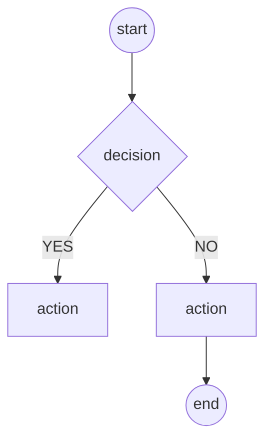

<!--
FILE: docs/operations/Flowcharting.md
VERSION: v0.5.0 (2026-08-18)
OWNER: Russell Catt
AUTHOR_OF_NOTES: Cursor (Implementer, track flowcharting_uml / S1)

DOCUMENT_TYPE: Operations Guide
PROJECT_NAME: Wargame_Concierge
PROJECT_STATUS: Active

SOURCES:
  - KB/concepts/flowcharting_uml_activity.md
  - KB/sources/uml_diagrams_org.md
  - reference/uml/README.md
  - reference/uml/activity-diagrams-controls.html (retrieved 2026-08-18)

PURPOSE:
  House standard for flowcharts in this repo. Maps print sheets and mermaid
  charts to UML 2.5 activity-diagram shapes. Not a Kill Team rules document.

UPDATE_TRIGGER:
  Update when the house mapping, HTML class names, or credit line change.
-->

# Flowcharting — UML 2.5 activity notation

How this project draws a yes/no tree. **Not** a rules source. Kill Team claims still come from owned PDFs and [`games/kill_team_2024/rules/Target_Eligibility.md`](../../games/kill_team_2024/rules/Target_Eligibility.md).

Working synthesis: [`KB/concepts/flowcharting_uml_activity.md`](../../KB/concepts/flowcharting_uml_activity.md). External snapshots (not project truth): [`reference/uml/README.md`](../../reference/uml/README.md).

---

## House mapping

| Draw | UML name | CSS / mermaid | Use for |
|------|----------|---------------|---------|
| Filled circle | Initial node | `.node-start` / mermaid `(())` | Start of the flow |
| Rounded rectangle | Action | `.node-action` / `[]` | A step the reader takes or an outcome |
| Diamond | Decision node | `.node-decision` / `{}` | A question. **One** outgoing edge is taken |
| `[YES]` `[NO]` (or other) on the **arrow** | Guard | `.guard` on the edge | Which way to go |
| Bullseye (disk in a ring) | Activity final | `.node-end` / mermaid `(())` | End of the flow |

**Color overlay is allowed** (orange question, red stop, green valid, blue sequence) **on** those shapes. Color must not replace the diamond vs rectangle distinction.

Skip unless you need them: merge (diamond, many-in one-out), fork/join bars, flow-final (circled X).

---

## QA-G checklist (every new chart)

1. Diamonds are **decisions** (questions). Rounded rects are **actions** (steps / terminals).
2. Guards live **on edges**, not as the only copy of the branch inside the diamond.
3. Start (filled circle) and end (bullseye) are **distinct** from actions.

Mermaid `(())` is a circle, not a true bullseye — acceptable on ops charts. Print HTML should use a real bullseye.

---

## Where it applies

| Artifact | Restyle depth |
|----------|----------------|
| [`Target_Eligibility_Cheat_Sheet.html`](../../games/kill_team_2024/rules/Target_Eligibility_Cheat_Sheet.html) | Full UML shapes. **Do not change decision logic or PDF cites.** |
| [`multiagent_coordinator_strategy.md`](multiagent_coordinator_strategy.md) mermaid | Lite: `{}` / `[]` / `(())`; same edges and meaning |
| Datacards under `games/kill_team_2024/teams/**/cards/` | **Not** flowcharts — leave them |

HTML class snippet: [`templates/flowchart_html_classes.md`](../../templates/flowchart_html_classes.md).

---

## Librarian / print sheets

When promoting a printable tree, follow this guide **and** [`librarian_agent.md`](librarian_agent.md) (promote). UML notation is `draft` against uml-diagrams.org (retrieved 2026-08-18), not `verified` as game rules.

---

## Change Log

- v0.5.0 (2026-08-18): Initial house guide. Track `flowcharting_uml` S1.

## Attribution

- Project: Wargame_Concierge
- Maintainer: Russell Catt
- Structured using the Rising Tide framework
- **Kill Team is Copyright Games Workshop Limited 2024**
- Notation reference: [uml-diagrams.org About](https://www.uml-diagrams.org/about.html). **Authored by Kirill Fakhroutdinov.** Copyright © 2009–2026 uml-diagrams.org. All rights reserved. Third-party teaching reference; **not** a Kill Team rules source.

## Rising Tide Notes

- This document follows Rising Tide documentation standards.
- Keep the receipts. Make AI show their work.
