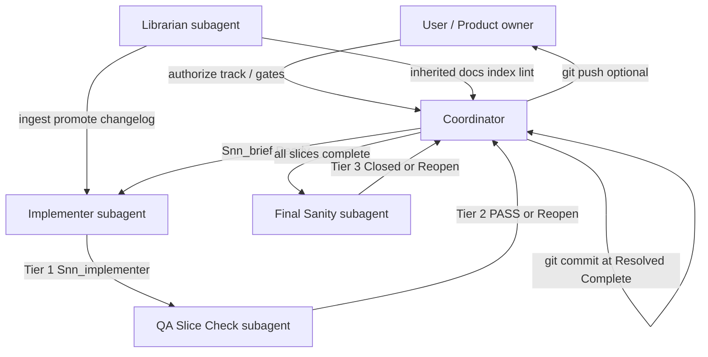

# Multi-agent coordinator strategy

A **selectively reusable** playbook for orchestrating Cursor agents (and humans) on multi-slice engineering tracks. The pattern was **designed and proven** in [`image_generator/docs/handoffs`](../../../image_generator/docs/handoffs) (v0.4 Tracks A–K) and **applied end-to-end** to build and verify [`src/test_design/`](../../src/test_design/) (promotion T0–T5 + follow-up track FT0–FT6).

Use this document when a task is too large for one agent session, needs independent QA, or must leave an audit trail for later operations (PV, migration, graduation tests, research tracks).

**Canonical handoffs root (Wargame_Concierge):** [docs/handoffs/](../handoffs/)

| Track | Path |
|-------|------|
| v1 scaffold — 40K 11e beginner content + Karpathy KB | [docs/handoffs/v1_scaffold/](../handoffs/v1_scaffold/) |

**Librarian slices in v1_scaffold:** L0 (KB bootstrap), L1 (Tier 0 ingest), L2 (lint) — see §18.4–18.5.

**Normative playbook for this repo:** this file.

---

## 1. Design goals

| Goal | How the workflow achieves it |
|------|------------------------------|
| **Auditability** | Every slice produces committed markdown artifacts (brief → implementer → QA → rollup). |
| **Separation of duties** | Implementer self-checks (Tier 1); independent QA re-verifies (Tier 2); track-wide Final Sanity (Tier 3). |
| **Safe git hygiene** | Subagents do **not** commit or push; Coordinator owns git at defined gates. |
| **Human control** | User gates on destructive ops (push, live Zephyr `--apply`, Scratchpad wipe). |
| **Recoverability** | Track-in + track-out documents carry constraints, folder IDs, and waivers to the next track. |
| **Throughput** | Pipelining: start slice N+1 when slice N reaches **Resolved - Implemented** while QA runs N. |

---

## 2. Roles

Five logical roles when knowledge governance matters; four suffice for code-only tracks. In Cursor they may be **separate subagents** or **sequential hats** — the **artifacts and tiers are what matter**, not the process count.

**Knowledge vs execution:** Coordinator / Implementer / QA / Final Sanity own the **execution plane** (code, CLI, live APIs). The **Librarian** owns the **knowledge plane** (`KB/`, promoted `docs/`, indexes, link hygiene) so other agents do not re-derive layout every session. Full Librarian playbook: **§18**.



### 2.1 Coordinator (parent agent)

**Owns:** track planning, slice briefs, entrance attestation, dispatch, pipelining, rollup rows, **sole `git commit`**, optional **`git push`**, user-gate documentation.

**Does not:** skip QA tiers; let subagents commit; merge slices without briefs.

**Typical outputs:** `track_{from}_to_{to}.md`, `slices/*_brief.md`, updates to project planning / rollup tables, commit messages like `v0.4-S17:` or `feat(test-design): …`.

### 2.2 Implementer subagent

**Owns:** Tier 1 execution — code, commands, artifacts, honest self-check in `*_implementer.md`.

**Must report:** model used, verbatim commands, results table, **Commit: pending** until Coordinator commits after QA.

**Must not:** `git commit`, `git push`, print secrets, write to production golden Zephyr folders without explicit user gate.

### 2.3 QA Slice Check subagent

**Owns:** Tier 2 — **independent** re-run or re-read of evidence against exit criteria from the brief (not implementer prose alone).

**Outputs:** `*_qa.md` with Gate PASS/FAIL, spot-check table, caveats.

**On FAIL:** `*_qa_reopen.md` + slice status **Reopened** → Implementer fix loop.

**Model choice:** Prefer a **different model family** than Implementer when possible (e.g. Codex implementer + Sonnet QA) to reduce shared blind spots.

### 2.4 Final Sanity subagent

**Owns:** Tier 3 — cross-slice consistency after **all** slices are **Resolved - Complete** (or **Blocked-Complete** with documented waiver).

**Outputs:** `track_{letter}_final_report.md` or `track_ft_final_report.md`; on fail, `track_{letter}_final_sanity_reopen.md`.

**Checks:** rollup completeness, golden matrices, no orphan Reopened slices, artifact paths on disk match reports.

---

## 3. Three-tier verification model

| Tier | Name | Who | When | Pass means |
|------|------|-----|------|------------|
| **1** | Implementer self-check | Implementer | Before `*_implementer.md` | All slice exit criteria met per implementer evidence |
| **2** | QA Slice Check | QA subagent | After **Resolved - Implemented** | Independent verification → **Resolved - Complete** or **Reopened** |
| **3** | Final Sanity | Final Sanity subagent | All slices terminal | Track **Closed - Complete** or track **Reopened** |

**Tier 1 examples (test_design):** `pytest tests/test_design/ -q`; CLI exit codes; export counts (40 tc / 14 §7).

**Tier 2 examples:** QA re-runs pytest; counts JSON rows; confirms dry-run logs exist.

**Tier 3 examples (FT track):** Golden-folder matrix 40/11/16 live; no `*_qa_reopen.md`; cross-slice path consistency.

---

## 4. Slice status state machine

| Label | Set by | Meaning |
|-------|--------|---------|
| `pending` | — | Not started |
| **Ready** | Coordinator | Brief issued; entrance criteria attested |
| **In progress** | Implementer | Work underway |
| **Resolved - Implemented** | Implementer | Tier 1 pass; QA may start |
| **Resolved - Complete** | QA | Tier 2 pass; Coordinator may commit |
| **Reopened** | QA or Final Sanity | Fix loop required |
| **Blocked-Complete (waiver)** | Coordinator + user | Cannot meet criterion; documented waiver (e.g. FT4 original sandbox) |
| **Closed - Complete** | Final Sanity | Tier 3 pass; track done |

**Flow:**

```
pending → Ready → In progress → Resolved - Implemented → Resolved - Complete
                                                      ↘ Reopened → In progress → …
All slices Resolved - Complete (or waived) → Final Sanity → Closed - Complete
                                                         ↘ Reopened (affected slices)
```

**Pipelining rule (from image_generator README):** Coordinator may dispatch slice **N+1** to Implementer when slice **N** is **Resolved - Implemented**, while QA runs slice **N** in parallel.

---

## 5. Artifact lifecycle (file types)

Commit these under a track folder (e.g. `docs/handoffs/` or `docs/migration/cleanup/handoffs/followup_tests/`).

| # | Artifact | Pattern | Author | Reader |
|---|----------|---------|--------|--------|
| 1 | Track hand-off **in** | `track_in.md` or `track_{from}_to_{to}.md` | Coordinator | Implementer, next track |
| 2 | Slice brief | `slices/{Id}_brief.md` | Coordinator | Implementer |
| 3 | Implementer report | `slices/{Id}_implementer.md` | Implementer | QA |
| 4 | QA report | `slices/{Id}_qa.md` | QA | Coordinator |
| 5 | QA reopen | `slices/{Id}_qa_reopen.md` | QA | Coordinator, Implementer |
| 6 | Final Sanity reopen | `track_*_final_sanity_reopen.md` | Final Sanity | Coordinator |
| 7 | Track final report | `track_*_final_report.md` | Final Sanity | User, next track |
| 8 | Rollup / program table | e.g. `test_design_followup_test_report.md` | Coordinator | Humans |
| 9 | Agent execution report | e.g. `v0.4_agent_execution_report.md` | Coordinator | Retrospective (optional capstone) |

**README:** Each handoffs folder should have a [`README.md`](../migration/cleanup/handoffs/followup_tests/README.md) mirroring lifecycle + current track state table.

---

## 6. Slice brief template (Coordinator)

Every brief should answer:

1. **Status** — Ready / entrance satisfied  
2. **Track + slice ID** — e.g. FT2, K1, S17  
3. **Requirements** — what to build or verify  
4. **Depends / User gate** — prior slices, approvals (push, `--apply`, wipe)  
5. **Entrance criteria** — Coordinator attestation table (YES/NO)  
6. **Exit criteria** — copied from plan; QA verifies verbatim  
7. **Tier 1 command(s)** — pytest, CLI, smoke scripts  
8. **Tier 2 expectations** — what QA must independently check  
9. **Recommended models** — Implementer vs QA  
10. **Inherited documentation** — links to investigation reports, KB run cards, golden folder IDs  

**Example (Log Sifter):** [`followup_tests/slices/FT0_brief.md`](../migration/cleanup/handoffs/followup_tests/slices/FT0_brief.md)

**Example (image_generator):** `image_generator/docs/handoffs/slices/K1_brief.md`

---

## 7. Implementer report template

Required sections:

- **Status:** Resolved - Implemented  
- **Model:** slug used  
- **Commit:** pending (until Coordinator commits after QA)  
- **Exit criteria self-check (Tier 1)** — table PASS/FAIL  
- **Commands (verbatim)** — reproducible  
- **Results table** — Expected vs Actual  
- **Artifacts** — paths created  
- **Notes / quirks** — non-obvious counting, env issues  

**Example:** [`FT0_implementer.md`](../migration/cleanup/handoffs/followup_tests/slices/FT0_implementer.md)

---

## 8. QA report template

Required sections:

- **Status:** Resolved - Complete | Reopened  
- **Model:** slug used  
- **Gate:** PASS | FAIL  
- **Exit criteria verification (independent)** — re-run or re-read  
- **Spot-check table**  
- **Caveats / blockers** — waivers, environmental skips  

On FAIL: create `*_qa_reopen.md` listing failed criteria and required fixes.

**Example:** [`FT0_qa.md`](../migration/cleanup/handoffs/followup_tests/slices/FT0_qa.md)

---

## 9. Git ownership rules

| Event | Who commits | Who pushes |
|-------|-------------|------------|
| Slice **Resolved - Complete** | **Coordinator** — one commit per slice (or batched per user preference) | — |
| Slice **Reopened** | No commit until next **Resolved - Complete** | — |
| Track **Closed - Complete** | Coordinator (if pending handoffs) | **Coordinator** — only with **user authorization** |
| Track **Reopened** (Final Sanity) | After fix loop | No push until Tier 3 pass |

**Subagents:** must **never** run `git commit` or `git push`.

**Commit message style:**

- image_generator: `v0.4.4-K1: …`, `v0.4-S17: …`  
- Log Sifter: conventional commits (`feat(test-design): …`, `docs: …`) with handoff files included in the same commit as code when possible  

**Promotion note:** Early test_design promotion used Coordinator commits on branch `feature/test-design-promotion`; follow-up FT track kept **no commit in subagents** rule even when Coordinator deferred push until user approval.

### 9.1 Deferred commit mode (IMP-09)

When the user requests **no commits during a session** (or batching at track close):

| Normal mode | Deferred commit mode |
|-------------|----------------------|
| QA verdict: "Coordinator **may commit**" | QA verdict: "**Eligible for batch commit**" |
| Per-slice `Commit SHA` in QA registry | Leave SHA blank; record session boundary in track final report |
| One commit per slice after QA PASS | Coordinator commits once after user authorizes (track close or explicit message) |

Subagents still **never** commit. Track final report (`track_*_final_report.md`) must state deferred-commit policy and list slices eligible for the batch.

### 9.2 Monolithic vs discrete execution (IMP-03)

**Source:** [`LIB2R21_coordinator.md`](../migration/cleanup/handoffs/knowledge_plane_ultra/slices/LIB2R21_coordinator.md) — first Puma ingest pilot.

| Pattern | When to use | Roles | Example |
|---------|-------------|-------|---------|
| **Monolithic** | Intake, small reconcile, ≤25 single-pass MCP calls | Coordinator brief → **Librarian** → **QA** | LIB2R0–3 cohort establishment |
| **Discrete** | Large inventory, repeated classification, cross-source checks, synthesis with table restatement | Brief → optional **Research helper** (raw tables) → **Librarian** (narrative) → **QA** | LIB2R4–11 Type triage, docs cross-check, rollup |

**Decision rule:** Use discrete helper when (a) cohort **>25 keys**, (b) **multi-slice reuse** of a Type inventory, (c) **>20 narrated table rows**, or (d) synthesis must restate tables from prior slices. Otherwise monolithic Librarian + QA is sufficient.

See also: [`librarian_agent.md`](librarian_agent.md) § Research helper dispatch.

### 9.3 Cohort-establishment bundle (IMP-08)

When **strict serial user gates** are not required, combine into **one slice** with internal checkpoints:

1. Cached `search_tickets` broad pull + `data_freshness`
2. `get_ticket` component filter → manifest stub
3. Live Jira reconcile vs saved filter

**Artifacts:** single `{Id}_librarian.md` with subsections; one `{Id}_lib_qa.md`. Split into LIB2R1–3-style slices only when the user requests stepwise review gates.

---

## 10. User gates and waivers

Document explicit user authorization **in the slice brief** (entrance table).

| Gate type | Example (test_design) |
|-----------|------------------------|
| Track start | User chat: "execute follow-up tests" |
| Live Zephyr `--apply` | Sandbox folder **38929954** + throwaway keys (FT4 retry) |
| Production golden folders | **Off-limits** unless explicit approval — 43721344, 44331646, 44722228 |
| Scratchpad wipe | FT6 — user authorized; only `PROMOTION_SUMMARY.md` survives |
| `git push` / merge to master | Separate user message after local verification |

**Blocked-Complete (waiver):** When a criterion cannot be met but the track must proceed, Coordinator records:

- what blocked (e.g. no sandbox folder),  
- user waiver quote or plan reference,  
- what was verified instead (e.g. zero production writes),  
- retry slice ID if applicable (FT4 → FT4 retry).

See [`FT4_retry_brief.md`](../migration/cleanup/handoffs/followup_tests/slices/FT4_retry_brief.md) and [`track_ft_final_report.md`](../migration/cleanup/handoffs/followup_tests/track_ft_final_report.md).

---

## 11. How Log Sifter applied this to `src/test_design`

### Phase A — Promotion (T0–T5)

Documented in [`test_design_src_promotion.md`](../migration/cleanup/test_design_src_promotion.md):

| Phase | Multi-agent pattern |
|-------|---------------------|
| **T0** | Audit-only; Coordinator recovery inventory (no subagent commits) |
| **T1–T5** | Scaffold `src/test_design/`, port Run_2.1/Run_3/Run_4.2 logic, pytest, KB sweep |
| **Outcome** | Promoted package + commit `2afafb4` on `feature/test-design-promotion` |

Promotion used the **same tier mindset** (evidence tables, exit criteria) but less formal per-slice handoff files than FT track. FT track **retrofitted** full handoff discipline.

### Phase B — Follow-up verification (FT0–FT6)

Full workflow under [`handoffs/followup_tests/`](../migration/cleanup/handoffs/followup_tests/):

| Slice | Purpose |
|-------|---------|
| **FT0** | Offline baseline — pytest, CLI, dry-run Zephyr |
| **FT1** | Inventory + stage 904 Scratchpad files |
| **FT2** | Run_2.1 + Run_3 replay; document T2 builder gaps |
| **FT3** | Live read-only Zephyr — 40/11/16 inventory + native-key diff |
| **FT4** | Sandbox apply (blocked → retry MET) |
| **FT5** | Final Sanity — track close |
| **FT6** | Scratchpad retirement |

**Rollup:** [`test_design_followup_test_report.md`](../migration/cleanup/test_design_followup_test_report.md)

### Phase C — ZP delivery packet workflow (HyperMax 12.1 Final Sanity)

ZP0-ZP7 (2026-07-10) validated the same coordinator pattern for live Zephyr delivery under strict user gates.

Proven outcomes:

- **Packets and rehydration flow:** Per-slice packet folders (`packets/ZP*`) kept inherited docs, gates, and run commands stable across handoffs.
- **QA pairing discipline:** Each implementer slice used an explicit QA pair (`*_qa.md`) plus reopen loops where needed before onward dispatch.
- **Dispatch registry as control plane:** [`ZP_dispatch_registry.md`](../project-notes/0.8/handoffs/hypermax_121_final_sanity/ZP_dispatch_registry.md) tracked ownership, status, and locked targets (`48722207`, `CR-R578`, `CR-P61`).
- **User-gated live ops:** `--apply`/link operations remained blocked until explicit approval, with read-only evidence maintained before and after each gate.

### What shipped in `src/test_design/`

The workflow produced a **verified** pipeline:

- CLI: `log-sifter test-design {init,scm,build,validate,zephyr}`  
- Profiles: `cr9008_formal_pv` (complete), `hypermax_12_sanity`, `touchdrive_m40` (SCM-only gaps)  
- Adapters: Zephyr REST with dry-run default  
- Tests: `tests/test_design/` — 22 pytest cases at FT0/FT6  
- Docs: [`docs/test_design/`](../../test_design/) governance set (0.5.0a0)  

---

## 12. Model selection (recommended)

Assign models in the **brief**; record actual model in implementer/QA reports.

| Role | Typical choice (Wargame_Concierge v1_scaffold) | Rationale |
|------|-----------------------------------|-----------|
| Coordinator | `inherit` (parent session) | Planning, git, user gates |
| **Librarian** | `claude-fable-5-thinking-high` | KB ingest, synthesis, link lint (L0, L1, L2) |
| Implementer — fast path | `composer-2.5-fast` | Scaffold, copies, path wiring (Preflight, S0, S2) |
| Implementer — content path | `claude-sonnet-5-thinking-high` | Teaching docs, laminate guides (S1, S3–S5, S6 SM) |
| Implementer — research path | `claude-opus-5-thinking-high` | Dense unit-rule capture (S6 Necrons) |
| QA — default | `gpt-5.6-sol-medium` | Independent family vs Claude |
| QA — light | `gemini-3.7-flash-high` | Fast path / light lib QA (S0, S2, L2) |
| Final Sanity | `gpt-5.6-terra-medium` | Track-wide consistency (S7) |

**Locked matrix:** [`docs/handoffs/v1_scaffold/track_in.md`](../handoffs/v1_scaffold/track_in.md) · Librarian day-to-day: [`librarian_agent.md`](librarian_agent.md) (L0)

**Not a hard rule** — single-agent tracks are valid if Tier 2/3 use **different evidence paths** (re-run commands, not trust implementer summary).

---

## 13. Optional: PUMA Collab integration

For **human-visible** multi-agent coordination (not a substitute for handoff files):

- Room per track: e.g. `LOGSIFTER-CR-9008-graduation`  
- `update_shared_state` for checklist keys (folder IDs, slice status, blockers)  
- Post **summaries** to room; keep **handoffs in git** as SoT  

See [`Scratchpad/Theorycraft/theorycraft_puma_collab.md`](../../Scratchpad/Theorycraft/theorycraft_puma_collab.md). Librarian **`ingest_queue`** pattern: **§18.6**.

---

## 14. When to use this workflow

**Use when:**

- Multiple sessions or subagents touch the same deliverable  
- Live integrations (Zephyr, Jira) or irreversible ops (delete, push)  
- You need a proof table for PV, migration, or audit  
- Research tracks with parallel batches (image_generator K2/K3/K4)  

**Skip or lighten when:**

- One-file doc fix with obvious verification  
- User explicitly wants single-agent fast path  
- No git commits planned (read-only analysis) — still useful: brief + report without tiers  

**Lightweight variant:** `brief.md` + `report.md` only (no QA subagent) for small investigations; keep Tier 1 command block.

---

## 15. Starting a new track (checklist)

1. Create handoffs folder + `README.md` + `track_in.md` (constraints, golden IDs, secrets policy).  
2. Write parent plan (Cursor plan or `docs/project-notes/`) with slice table and exit criteria.  
3. User authorizes track start.  
4. **If research-heavy:** Librarian Tier 0 (§18) — scope doc + inherited links before Implementer slices.  
5. For each slice: `{Id}_brief.md` → Implementer → `{Id}_implementer.md` → QA → `{Id}_qa.md`.  
6. Coordinator commit at **Resolved - Complete** (include code + handoffs + optional KB promotion).  
7. Append rollup row.  
8. Final Sanity → `track_*_final_report.md`.  
9. User gate → push / merge if applicable.  
10. Optional: `track_{out}_to_{next}.md`; Librarian ensures index/changelog reflect track outputs.

---

## 16. Future application — graduation test (preview)

The [graduation test plan](https://rossvideo.atlassian.net/browse/CR-9008) (SideShot / Naboo 3.0 UDC) should reuse this strategy:

- Track folder: e.g. `docs/migration/cleanup/handoffs/graduation_naboo_udc/`  
- **Librarian slice G-L0 (Tier 0):** MCP scope doc + KB/platform updates before catalog delta  
- Slices: MCP scope → catalog delta → pipeline run → Zephyr subfolder import → test cycle  
- User gate: subfolder under **43721344** (not production root writes)  
- Deliverables: scope doc, run workspace, cycle report — same tier discipline  

---

### 2.5 Librarian subagent

**Owns:** KB ingest, lint, query, promotion to `docs/`, index updates, **Inherited documentation** blocks for slice briefs.

**Does not:** implement product code, run Zephyr `--apply`, replace Coordinator git rules on slice commits, store large logs in Collab.

**When to spin up:** See **§18.2** — not before `KB/index.md` + ingest contract exist. **Current:** dedicated Librarian on research tracks (LIB1 + LC validated 2026-07-03).

**Day-to-day workflow:** [`librarian_agent.md`](librarian_agent.md) — regular-use guide (query → ingest → lint → promote → changelog).

---

## 17. Knowledge plane vs execution plane

Multi-agent tracks run on **two planes** that must not be conflated:

| Plane | Roles | Artifacts | Success signal |
|-------|-------|-----------|----------------|
| **Execution** | Coordinator, Implementer, QA, Final Sanity | Code, pytest, CLI logs, Zephyr dry-run/apply | Tiers 1–3 PASS |
| **Knowledge** | Librarian (+ human review for `docs/` promotion) | KB pages, index, changelog, inherited brief blocks | Tier 0 PASS; link lint clean |

**Coordinator** bridges both: dispatches Librarian before research-heavy Implementer slices; copies **Inherited documentation** from `*_librarian.md` into `{Id}_brief.md`; commits KB/doc changes with the same or adjacent commit as code.

**Rule of thumb:** If an agent would need to “explore the repo to find where X is documented,” Librarian work should have run first.

Full Librarian playbook: **§18**.

---

## 18. Librarian agent — KB and docs governance

The Librarian implements the **Karpathy-style hybrid KB** pattern described in [`Scratchpad/Theorycraft/theorycraft_0.4_execution_plan.md`](../../Scratchpad/Theorycraft/theorycraft_0.4_execution_plan.md) §3 and [`Scratchpad/Theorycraft/Migration/KB_and_R1c_harmonization.md`](../../Scratchpad/Theorycraft/Migration/KB_and_R1c_harmonization.md). **Day-to-day operations:** [`librarian_agent.md`](librarian_agent.md). It is **orthogonal** to the Coordinator slice loop: Librarian work **feeds** briefs and **captures** track outputs; it does not replace Tier 1–3 verification of code or live ops.

### 18.1 Purpose in multi-agent tracks

| Problem without Librarian | Librarian fix |
|---------------------------|---------------|
| Each Implementer re-discovers where platform docs live | Maintains [`KB/index.md`](../../KB/index.md) + machine index as **agent entry** |
| PUMA research scattered across chat | Named checkpoints under run workspace + KB promotion trail |
| `docs/` and `KB/` drift | Lint links (§L **L4.4**); promote stable facts via [`KB/changelog.md`](../../KB/changelog.md) |
| Brief **Inherited documentation** sections empty | Librarian pre-flight fills links, scope notes, glossary anchors |
| Track ends with tacit knowledge | Scope docs, run cards, handoff **track-out** written to durable paths |

**Canonical split (Log Sifter):**

| Tree | Role | Librarian writes? |
|------|------|------------------|
| **`docs/`** | Shipping SoT — product truth | Promote **after review**; Librarian drafts, human/Coordinator approves |
| **`KB/`** | Working layer — experiments, platforms, integrations | **Yes** — primary edit surface |
| **`lab/puma_sync/`** | Non-canonical Puma Sync lab | **No** verbatim promotion; mine for hints only |
| **`output/`** | Gitignored run workspaces | Librarian **indexes** paths in run cards, does not commit run data |

### 18.2 Maturity levels (when to name a Librarian)

From execution plan §3 — do not over-automate early:

| Maturity | Gate | Librarian mode |
|----------|------|----------------|
| **0 — absent** | No `KB/index.md`, no ingest contract | Coordinator pastes ad hoc links into briefs (fragile) |
| **1 — pilot** | `KB/index.md` + [`KB/ingest_procedure.md`](../../KB/ingest_procedure.md); one successful **manual** ingest | Complete (LIB1 + LC track, 2026-07-03) — [`KB_Refresh_Structured_prompt.md`](../../config/kb_refresh/KB_Refresh_Structured_prompt.md) + §L lint |
| **2 — dedicated** | **L4.2** ingest contract stable; CLI/tools read [`KB/kb_index.yaml`](../../KB/kb_index.yaml) | **Current** — named Librarian subagent on research-heavy tracks (graduation test, R1c platform passes, 0.8 LC/CU-style corpus work) |
| **3 — queued** | Collab `ingest_queue[]` + numbered ingest tickets | Librarian runs batches; PM/human approves promotion to `docs/` |

**Rule:** Dedicated Librarian is **default** for research-heavy tracks (LIB1 + L4.4 satisfied 2026-07-03) — not before first kernel JSON unless R1c is explicitly pulled forward ([`KB/ingest_procedure.md`](../../KB/ingest_procedure.md) § Librarian timing). KB refresh orchestrator uses [`config/kb_refresh/`](../../config/kb_refresh/) (Log Sifter extension on Python_Projects puma-refresh STRUCTURED_PROMPT).

### 18.3 Responsibilities (what Librarian does)

| Function | Actions | Outputs |
|----------|---------|---------|
| **Query** | Answer “where is X documented?” from index + crosswalk | Short **KB query memo** linked in brief |
| **Ingest** | PUMA `get_ticket` → stable raw filenames in run `checkpoints/raw/`; BookStack/manual excerpts → KB paths per [`ingest_procedure.md`](../../KB/ingest_procedure.md) | Updated KB pages; raw immutability preserved |
| **Lint** | Broken links, stale Scratchpad paths, version strings | Lint table in `*_librarian.md` |
| **Promote** | KB delta → `docs/platforms/`, `docs/test_design/`, etc. | Row in [`KB/changelog.md`](../../KB/changelog.md) |
| **Index** | `KB/index.md`, run cards under `KB/experiments/runs/` | Agents start from one catalog |
| **Brief support** | Fill **Inherited documentation** + entrance “KB ready” attestation | Coordinator copies into `{Id}_brief.md` |

**Ingest order (default batch):** glossary + platform matrix → `KB/platforms/*` → delta to `docs/platforms/*` → pipeline → integrations → analyses. See execution plan §6.

### 18.4 Librarian slice pattern (within a track)

Librarian work can be **standalone slices** (L0, L1, …) or **pre-gates** before Implementer slices. Recommended artifacts:

| Artifact | Pattern | Author |
|----------|---------|--------|
| Librarian brief | `slices/L{n}_brief.md` or `{TrackId}_lib_brief.md` | Coordinator |
| Librarian report | `slices/L{n}_librarian.md` | Librarian |
| Librarian QA | `slices/L{n}_lib_qa.md` | QA (optional — link lint + spot-check citations) |

**Entrance (Coordinator attests):**

- Ingest ticket or research question is **scoped** (Jira keys, paths, done criteria).  
- Sources of record identified (PUMA ticket, BookStack URL, run workspace) — not Collab message walls alone.

**Exit (Librarian self-check + optional QA):**

- All claims in scope doc / inherited block have **stable file paths**.  
- Link lint PASS on touched paths (or documented exceptions).  
- `KB/changelog.md` row if promotion occurred.  
- **No secrets** printed; `.env` untouched.

**Git:** Librarian subagent does **not** commit. Coordinator may bundle KB/doc edits:

- **Same commit** as related Implementer slice when promotion is part of deliverable, **or**  
- **Separate commit** `docs(kb): …` when Librarian batch stands alone — still Coordinator-only.

### 18.5 Tier model extension — knowledge entrance (Tier 0)

Optional **Tier 0 — Knowledge ready** before Implementer **Ready**:

| Tier | Name | Who | Pass means |
|------|------|-----|------------|
| **0** | Knowledge entrance | Librarian (+ Coordinator attestation) | Inherited documentation complete; index paths exist; blockers logged |
| **1** | Implementer self-check | Implementer | (unchanged) |
| **2** | QA Slice Check | QA | (unchanged) |
| **3** | Final Sanity | Final Sanity | (unchanged) |

**Lightweight tracks:** Skip Tier 0 when slice only touches `src/` and brief already links existing `docs/test_design/` pages.

**Research-heavy tracks:** Tier 0 **required** (graduation test MCP scope, image_generator K-track corpus).

### 18.6 PUMA Collab + Librarian queue

Collab is a **queue and provenance layer**, not the wiki store ([`theorycraft_puma_collab.md`](../../Scratchpad/Theorycraft/theorycraft_puma_collab.md) §8).

**Recommended `shared_state` keys:**

```json
{
  "ingest_queue": [
    {"id": "ING-001", "title": "Naboo UDC scope", "jira": ["CR-9008", "CR-9814"], "status": "ready"}
  ],
  "wiki_lint_status": "pass",
  "blocked_on": "",
  "kb_paths_touched": ["KB/platforms/ShotBox_Naboo.md"]
}
```

**Controlled loop:**

1. PM / Coordinator posts **numbered ingest ticket** (title + paths + done criteria) to room or handoff brief.  
2. Librarian runs ingest → posts **diff summary** + lint result to `*_librarian.md` (git SoT) and one-line summary to Collab.  
3. Human approves promotion to `docs/`; Coordinator commits.

**Do not:** paste full PUMA dumps into Collab without filenames; replace `checkpoints/raw/` immutability; let Librarian commit.

### 18.7 Interaction with Implementer / QA

| Phase | Librarian | Implementer | QA |
|-------|-----------|-------------|-----|
| **Before slice** | Tier 0 — scope doc, inherited links | — | — |
| **During slice** | Answer structured KB queries via Coordinator | Code / CLI | — |
| **After slice** | Promote durable facts; update run card | `*_implementer.md` | Verifies **code** exit criteria — not full KB lint unless slice touched docs |
| **Track close** | Ensure track-out + index + changelog complete | — | Final Sanity may spot-check doc paths cited in rollup |

**Division of labor:** QA verifies **slice exit criteria** (pytest, counts, HTTP codes). Librarian QA (optional) verifies **citation and link integrity** on doc-heavy slices — use a different model family when possible.

### 18.8 Graduation test example (SideShot / Naboo UDC)

| Slice | Librarian deliverable | Feeds |
|-------|----------------------|-------|
| **G-L0** (Tier 0) | `docs/test_design/graduation_naboo_udc_scope.md` from PUMA + BookStack UDC pages | Implementer catalog delta brief |
| **G-L1** (parallel) | Update `KB/platforms/ShotBox_Naboo.md` Naboo 3.0 / UDC procedure; changelog row | Human operators + test cycle plan |
| **Post-import** | Run card `KB/experiments/runs/graduation_naboo_udc.md`; link native Zephyr keys in index | Future diff tracks |

Implementer slice **G1** entrance criterion: **G-L0 Resolved - Complete** (Inherited documentation attested in brief).

### 18.9 What Librarian must not do

- Commit or push (Coordinator only).  
- Treat `lab/puma_sync/` as canonical without promotion.  
- Overwrite **`docs/`** shipping truth without changelog + review.  
- Store secrets or full log bodies in KB or Collab.  
- Block Implementer on perfect wiki — **minimum viable inherited block** beats waiting for full L4.3 analyses.

### 18.10 Librarian report template (summary)

```markdown
# L{n} — Librarian report
- **Status:** Resolved - Complete
- **Model:** …
- **Ingest ticket:** ING-…
- **Sources:** CR-…, BookStack URL, run path
- **Paths touched:** KB/…, docs/… (or none)
- **Promotion:** KB/changelog row YYYY-MM-DD
- **Lint:** PASS | FAIL (list)
- **Inherited block for next brief:** (paste-ready markdown links)
- **Blockers:** …
```

---

## 19. Reference index

| Document | Path |
|----------|------|
| image_generator handoffs README | `Python_Projects/image_generator/docs/handoffs/README.md` |
| image_generator planning (workflow §) | `Python_Projects/image_generator/docs/Project_Planning.md` |
| Log Sifter FT handoffs README | [`handoffs/followup_tests/README.md`](../migration/cleanup/handoffs/followup_tests/README.md) |
| FT track input | [`handoffs/followup_tests/track_in.md`](../migration/cleanup/handoffs/followup_tests/track_in.md) |
| FT Final Sanity | [`handoffs/followup_tests/track_ft_final_report.md`](../migration/cleanup/handoffs/followup_tests/track_ft_final_report.md) |
| Promotion audit | [`test_design_src_promotion.md`](../migration/cleanup/test_design_src_promotion.md) |
| Follow-up rollup | [`test_design_followup_test_report.md`](../migration/cleanup/test_design_followup_test_report.md) |
| test_design governance | [`docs/test_design/README.md`](../../test_design/README.md) |
| Agent tool profile | [`KB/experiments/tools/test_design_agent.md`](../../KB/experiments/tools/test_design_agent.md) |
| 0.4 execution plan (Librarian §3) | [`Scratchpad/Theorycraft/theorycraft_0.4_execution_plan.md`](../../Scratchpad/Theorycraft/theorycraft_0.4_execution_plan.md) |
| KB harmonization (L4, ingest) | [`Scratchpad/Theorycraft/Migration/KB_and_R1c_harmonization.md`](../../Scratchpad/Theorycraft/Migration/KB_and_R1c_harmonization.md) |
| KB ingest procedure | [`KB/ingest_procedure.md`](../../KB/ingest_procedure.md) |
| KB master catalog | [`KB/index.md`](../../KB/index.md) |
| KB promotion log | [`KB/changelog.md`](../../KB/changelog.md) |
| Librarian day-to-day ops | [`librarian_agent.md`](librarian_agent.md) |
| Backlog pivot handoffs (BP) | [`handoffs/backlog_pivot/README.md`](../migration/cleanup/handoffs/backlog_pivot/README.md) |
| Knowledge plane handoffs (LIB) | [`handoffs/knowledge_plane_ultra/README.md`](../migration/cleanup/handoffs/knowledge_plane_ultra/README.md) |
| LC track (0.8 Librarian catch-up) | [`0.8/handoffs/librarian_catchup/`](../project-notes/0.8/handoffs/librarian_catchup/) |
| CU track (12.2 unification) | [`0.8/handoffs/carbonite_122_unification/`](../project-notes/0.8/handoffs/carbonite_122_unification/) |
| TE track (test estimate) | [`0.8/handoffs/test_estimate_122/`](../project-notes/0.8/handoffs/test_estimate_122/) |
| KB refresh config | [`config/kb_refresh/`](../../config/kb_refresh/) |

# --- End of multi-agent coordinator strategy ---
