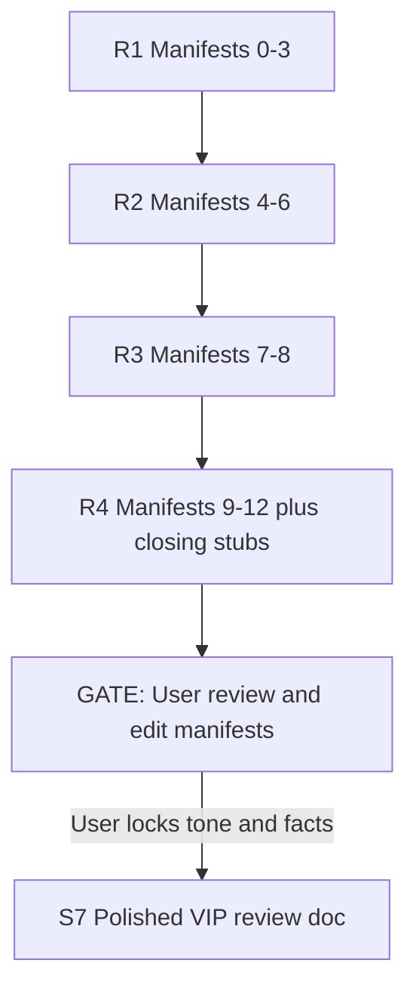
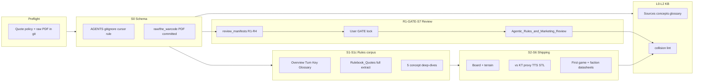

# The Warcode: Tactical Doctrine — multi-agent track plan

## Context and locked decisions

| Item | Value |
|------|--------|
| **Game** | [The Warcode](https://pre-launch.thewarcode.com/) — 2-player sci-fi skirmish by RedMakers; [Gamefound campaign](https://gamefound.com/en/projects/redmakers/the-warcode) (Sep 2026) |
| **Rules source** | `The Warcode Rulebook V.0.8.7-F.pdf` (~37 pp) — **free public beta**; **committed in git** under [`raw/the_warcode/`](raw/the_warcode/) |
| **Quote policy** | **Owner-locked:** beta is freely distributed → **full verbatim quotes and deep rules dives allowed** under scoped paths (see below). This is the opposite of the GW paraphrase default. |
| **VIP** | $1 VIP only — **no beta STLs yet**; proxy + TTS path until Field Commander / campaign |
| **TTS** | Workshop item **subscribed in Steam**; **Tabletop Simulator not purchased yet** — doc must capture workshop URL + purchase gate |
| **Git branch** | [`feature-Warcode`](feature-Warcode); ship via PR → squash merge to `main` |
| **Scaffold** | [`docs/Game_System_Scaffold.md`](docs/Game_System_Scaffold.md) §A2 + §F, **plus** KT-level rules depth (quote appendix + concept deep-dives) |
| **Pattern track** | Mirror [`docs/handoffs/kill_team_2024_scaffold/`](docs/handoffs/kill_team_2024_scaffold/) slice lifecycle |
| **External review archive** | [`reference/Warcode_Tactical_Doctrine_Plan.md`](reference/Warcode_Tactical_Doctrine_Plan.md) — snapshot for VIP/external readers (re-sync when plan locks change) |
| **Cross-game naming (shipping)** | **Never** name Kill Team in `games/the_warcode/**` (or other Warcode non-gitignored shipping). Use coy monikers: **That other game**, **Murder Platoon**. Internal handoffs may say KT24 for agents only. |

---

## Warcode quote exception (locked — Preflight)

RedMakers **free beta rulebook** gets a project-wide scoped exception, modeled on KT24 / 40K WarCom-free patterns.

### Scoped paths (verbatim allowed)

| Path | What may be quoted |
|------|-------------------|
| [`games/the_warcode/rules/**`](games/the_warcode/rules/) | Full rules text from beta PDF — mechanics, examples, glossary terms |
| [`games/the_warcode/setup/**`](games/the_warcode/setup/) | Board setup, map layouts, deployment, terrain interaction |
| [`games/the_warcode/factions/**`](games/the_warcode/factions/) | Squad rosters, unit profiles, weapons, Protocol cards, leader abilities |
| [`raw/the_warcode/**`](raw/the_warcode/) | The PDF itself (binary) + optional markdown extracts if useful |

### Cite format (every quote block)

```
Source: The Warcode Rulebook V.0.8.7-F.pdf — p.{N} — "{section heading}"
```

Optional stable IDs once defined in `Rulebook_Quotes.md` (e.g. `ACTIVATION — 02.01`).

### Cross-game naming — SAFETY (locked)

**Never mention Kill Team by name** in this game’s **non-gitignored / shipping** files — especially anything under [`games/the_warcode/`](games/the_warcode/). **EVER.**

| Allowed moniker (coy OK) | Use for |
|--------------------------|---------|
| **That other game** | Default public-facing comparison label |
| **Murder Platoon** | Alternate coy moniker when variety helps |

Applies to: comparative glossary, vs-guide, proxy doc, VIP review, Keyword_Glossary collision asides, faction READMEs, First Game walkthrough — **all** Warcode shipping.

**Exceptions (internal only):** `docs/handoffs/warcode_tactical_doctrine/**` and this Cursor plan may say KT24 so agents can find paths; do **not** copy those strings into shipping.

**Lint:** L2 + Final Sanity grep `games/the_warcode` for `Kill Team`, `KillTeam`, `KT24`, `kill_team` → **fail** if found (wikilinks to other systems’ paths may use folder names only if unavoidable — prefer no link text that names the game).

### Still paraphrase-only

| Path | Why |
|------|-----|
| `KB/**` | Karpathy layer — synthesis + `[[wikilink]]` to quote files (same as 40K) |
| `docs/**` | Operations / handoffs |
| Marketing copy on pre-launch / Gamefound | Living web — paraphrase + retrieval date; link out |
| **STL files** | Never commit binaries; official pledge only |
| **GW content** | Unchanged — Codex wall, KT/40K rules stay on their own exceptions |

### Schema updates (S0 — not deferred)

1. **[`AGENTS.md`](AGENTS.md) Sec 10** — add **Warcode beta quote exception** (paths, cite format, beta version hierarchy: v0.8.7-F baseline until a newer free beta supersedes on the same topic)
2. **[`.gitignore`](.gitignore)** — keep `*.pdf` global block; add negation for Warcode beta only:
   ```
   !raw/the_warcode/
   !raw/the_warcode/**
   ```
3. **[`raw/README.md`](raw/README.md)** — new row: Warcode beta PDF is an **explicit allowed binary** (free distribution; not GW)
4. **[`.cursor/rules/warcode-quotes.mdc`](.cursor/rules/warcode-quotes.mdc)** — scoped glob `games/the_warcode/**` + `raw/the_warcode/**` (mirror [`kt24-quotes.mdc`](.cursor/rules/kt24-quotes.mdc))
5. **[`raw/the_warcode/README.md`](raw/the_warcode/README.md)** — provenance, version, retrieval date, “free beta — commit allowed”

### PDF in `raw/` (S0)

**Do not** relocate to `C:\Personal\The Warcode\`. The beta PDF lives in-repo:

- Move/rename to: `raw/the_warcode/The Warcode Rulebook V.0.8.7-F.pdf`
- Add pointer stub: [`raw/pointers/warcode_rulebook_v087f.md`](raw/pointers/warcode_rulebook_v087f.md) → `../the_warcode/The Warcode Rulebook V.0.8.7-F.pdf`
- **Commit the PDF** on `feature-Warcode` (first track commit that adds it)

### OCR note (research — locked)

Some beta rulebook content is **flattened images**, not selectable text — notably **Protocol Cards** (and possibly other card/layout pages). For S1b / S1c / S6 / R* research:

1. Prefer native PDF text extraction first (`PyMuPDF` / similar).
2. When a page yields empty or garbage text, **run OCR** on that page (or the image region) before marking gaps.
3. OCR sidecars may live under `raw/the_warcode/` as `.ocr.txt` / page dumps if useful for agents — UTF-8 markdown pointers cite them; **do not** invent Protocol Card text from marketing when OCR is available.
4. Every OCR-sourced quote: cite `V.0.8.7-F.pdf` page + note `via OCR` in the cite line.
5. Flag OCR confidence (`draft` if uncertain glyphs) in manifests and datasheets.

---

## System identity

| Field | Choice |
|-------|--------|
| **System slug** | `the_warcode` |
| **Subtree** | [`games/the_warcode/`](games/the_warcode/) |
| **Force folder** | `factions/` |
| **KB `system:` tag** | `the_warcode` |

### Vocabulary mapping (seed for `games/the_warcode/README.md`)

| Scaffold term | The Warcode |
|---------------|-------------|
| Force | Squad (8 units) |
| Force organisation | Faction pick + equipment distribution |
| Force-wide rule | Faction / leader abilities, Protocol cards |
| Round structure | 4 fixed rounds; Initiative → Tactical (alternating unit activation) |
| Scoring | VP + scenario; **Contracts** when behind |
| Board | **33" × 24"**; 6 capture layouts (marketing); full dimensions in rulebook p.27+ |
| Distinct mechanics | **AP**, **ammo/reload**, **Overwatch**, **melee lock**, **loot**, **event cards** |

---

## Rules corpus — “go nuts” scope

Match or exceed KT24 shipping depth for the **free beta** ruleset. Teaching docs **link to** `Rulebook_Quotes.md`; deep-dives **quote liberally** with page cites.

### S1b — `rules/Rulebook_Quotes.md` (primary appendix)

Full verbatim extraction organized by rulebook TOC:

- Setup sequence (scenario, deploy, equipment)
- Game phases (Initiative, Tactical, end-of-round)
- Unit activation & AP actions (Move, Shoot, Reload, Overwatch, Melee, Engage, Disengage)
- Unit attributes (HP, Agility, Armor, Movement)
- Ranged & melee combat (ammo, penetration, criticals, shooting through friendlies)
- Melee lock, disengage, escape
- Equipment (grenades, medkit, item pickup, doors)
- Contracts, re-rolls, VP calculation
- Protocol cards (OCR if flattened image pages)
- Worked examples (shooting, melee) — quoted in full

**Target:** essentially the whole rulebook text, structured for Obsidian search — same ambition as [`games/warhammer_40k_11e/rules/Core_Rules_Quotes.md`](games/warhammer_40k_11e/rules/Core_Rules_Quotes.md). **OCR** Protocol Cards and any other image-flattened pages before declaring S1b complete.

### S1c — Concept deep-dives (quoted + explained)

| File | Content |
|------|---------|
| `rules/Activation_and_AP.md` | Alternating activation, AP economy, pass/overwatch traps |
| `rules/Combat_Ranged_and_Melee.md` | Shooting sequence, ammo, melee lock, engage radius |
| `rules/Equipment_Loot_and_Doors.md` | Gear drops, medkits, grenades, door rules |
| `rules/Contracts_and_VP.md` | Comeback contracts, VP timing, tie-breakers |
| `rules/Scenarios_and_Events.md` | Scenario read step, event cards, map layouts |

Each file: **quote the rule first**, then a short “at the table” teaching paragraph.

### S6 — Faction quoted datasheets

Beta PDF includes **Protagen Marines** and **Ulfari** team lists (pp. 33–36). Ship:

- [`factions/protagen_marines/Squad_Datasheet.md`](games/the_warcode/factions/protagen_marines/Squad_Datasheet.md) — full quoted roster + Protocol cards from PDF
- [`factions/ulfari/Squad_Datasheet.md`](games/the_warcode/factions/ulfari/Squad_Datasheet.md) — same
- **MDR / Dominium** — `stub` pages citing web marketing until a free beta page ships; no invented stats

### S6 — First game + QR

- [`First_Game_Walkthrough.md`](games/the_warcode/First_Game_Walkthrough.md) — step-by-step first proxy session (Protagen vs Ulfari)
- [`Quick_Reference_Play_Guide.md`](games/the_warcode/Quick_Reference_Play_Guide.md) — two-page target (Scaffold §C); dense quotes + tables OK

---

## Research inputs (websites + PDF)

**Websites** (paraphrase + retrieval date):

- [Pre-launch](https://pre-launch.thewarcode.com/) — factions, 4 rounds, contracts, ammo, VIP
- [Gamefound](https://gamefound.com/en/projects/redmakers/the-warcode) — STL tiers, Sep 2026
- [VIP Facebook](https://www.facebook.com/groups/1548626022918599) — community, TTS link discovery

**PDF** — primary truth; **full quote source** for S1b/S1c/S6.

**STL** — official Gamefound Field Commander tier only until pledge; proxies until then.

---

## Agentic Rules & Marketing Review (VIP Facebook deliverable)

**Goal:** A **balanced survey** of The Warcode — rules, marketing, and developer materials — suitable for sharing in the [VIP Facebook group](https://www.facebook.com/groups/1548626022918599).

**Audience:** Fellow VIPs and curious backers — informed, fair, not a puff piece or a takedown.

**Final artifact:** [`games/the_warcode/reviews/Agentic_Rules_and_Marketing_Review.md`](games/the_warcode/reviews/Agentic_Rules_and_Marketing_Review.md)

**Working artifacts (pre-gate):** [`docs/handoffs/warcode_tactical_doctrine/review_manifests/`](docs/handoffs/warcode_tactical_doctrine/review_manifests/) — one short manifest per section; bullet-heavy, cited, `confidence:` tagged; **not** VIP-polished prose.

**KB mirror (optional L1):** [`KB/analyses/warcode_agentic_review_2026_08.md`](KB/analyses/warcode_agentic_review_2026_08.md) — paraphrase summary + link to shipping review after S7.

### Two-phase workflow (mandatory)



**Rule:** No polished body prose ships until **GATE** is **Resolved - Complete** with user sign-off recorded in `review_manifests/GATE_user_lock.md`.

### Section outline (locked)

| § | Title | Manifest focus |
|---|--------|----------------|
| **0** | **What this document is not** | Near-top disclaimer; **must include the words “unofficial and unauthorized”** (see locked bullets below). Draft in GATE/S7 from owner voice; R1 may stub bullets only |
| **1** | What is The Warcode: Tactical Doctrine? | Elevator pitch; genre; scale (2p, 8 units, 4 rounds, ~120 min); relationship to “Tactical Doctrine” subtitle if explained in materials |
| **2** | Who is developing the game? | RedMakers team; prior credits; what they’re known for; **web research required** (Gamefound bios, pre-launch, red-makers.com, BGG/KS history if any) — flag gaps honestly |
| **3** | Core principles of the game | Design pillars from rules + marketing (ammo, contracts, loot, fixed length, alternating activation, etc.) |
| **4** | Setting and plot | Sealed star system, three factions, outside threat — cite marketing; note what beta rules actually deliver vs lore depth |
| **5** | Factions / teams | MDR, Ulfari, Protagen Marines, Dominium — roster presence in beta PDF vs web-only |
| **6** | Key concepts per faction | Playstyle, difficulty tags from pre-launch; leader/protocol hooks where known |
| **7** | Core game loop (brief) | Setup → 4 rounds → VP/contracts; link to `Rulebook_Quotes` when available |
| **8** | Commentary: Who is this game for? | Sub-questions (all required): rules legibility; **16+ / mature tone**; newcomers; casual; journeyman veterans; **organized play** (see locked OP definition below) |
| **9** | Market differentiation | How materials position vs skirmish crowd / **That other game** (Murder Platoon); use [`Warcode_vs_That_Other_Game.md`](games/the_warcode/guides/Warcode_vs_That_Other_Game.md) when S3 exists |
| **10** | Rules vs marketing (“Where’s the beef?”) | Claim-by-claim table: marketing promise → beta rules evidence → verdict (`delivers` / `partial` / `not yet in beta` / `TBD`) |
| **11** | What is good or unique | Strengths backed by rules text or consistent marketing |
| **12** | What needs polish pre-Gamefound | Gaps, ambiguities, missing factions in beta, layout, examples, organized-play kit; **plus reportable documentation / “software” bugs** (see below) |
| **13** | *(placeholder)* A non-agentic VIP’s view | **Reserved heading only** in S7 — user fills after reading; do not agent-draft |
| **14** | Thank you | Closing thanks to RedMakers for freely publishing the beta rules; editor respects their bravery |
| **15** | Ownership / trademarks (legalese) | Ownership blurb + copyrights/trademarks from materials + Gamefound URL; **must state this review is unofficial and unauthorized** |
| **16** | **Comparative glossary** (vs That other game) | End-of-document reference — see S8; may inline or link to `rules/Comparative_Glossary.md` |

#### §16 / S8 — Comparative glossary (locked)

**Primary shipping file:** [`games/the_warcode/rules/Comparative_Glossary.md`](games/the_warcode/rules/Comparative_Glossary.md)  
**Also:** end section of the VIP review (§16) — either full table or “see Comparative_Glossary” + top N highlights.

For **every proper keyword / defined term** used in the beta rulebook:

1. **Term** (canonical spelling from PDF)
2. **Definition** — as provided by the rulebook (verbatim quote OK under Warcode quote exception; page cite)
3. **Agentic commentary** — exactly **one sentence** clarifying a complex or easy-to-misread point
4. **Bridge line** — exactly one sentence in brackets, form: `(This seems related to X)` where **X** is a related concept from **That other game** / **Murder Platoon** (never name Kill Team). Example: Tactical Phase → `(This seems related to the Firefight Phase in That other game.)`

**Slice S8** builds the full glossary (depends on S1b keywords + OCR terms). **S7** adds §16 pointing at it (or embeds a condensed table). **R3/R4** may stub high-value bridges in manifests; full list is S8.

#### §8 — Organized play (locked definition)

**Not** “is there a Discord / Facebook / TTS lobby.” Assess whether the **game system** (as published to date) can support **structured multi-session play**, for example:

| Question | What to look for in materials |
|----------|-------------------------------|
| **League?** | Enough scenarios / map variety / scoring persistence / seasonable formats that a local league could run multiple weeks without inventing half the product |
| **Narrative campaign?** | Lore hooks, linked scenarios, progression, contracts/events that compound — or an honest “not yet / needs a campaign pack” |
| **Tournament / BCP-class events?** | Whether the design could live under a [Best Coast Pairings](https://www.bestcoastpairings.com/)-style organizer stack: clear match length, pairable formats, ranking-friendly scoring, TO-friendly ambiguity level, faction balance maturity |

R3 manifest must answer each row with evidence from beta rules + marketing, or `not yet evidenced`. Community platforms (VIP FB, Gamefound, TTS) may be **secondary notes** only — they are distribution channels, not organized-play **content**.

#### §0 — What this document is not (locked voice; GATE-editable)

Place **immediately after** title/header, **before** §1. Required points:

- This document is **unofficial and unauthorized**. It is **one VIP’s attempt** to get the project to make sense in his head **prior to the Gamefound launch** — not an official RedMakers review, endorsement, or communication from RedMakers or Gamefound.
- Quoted materials come from **publicly available** sources; research, drafting, and QA were done by **various agentic models**; **overall tone and editorial slant belong to the creator’s own internal biases**. He aims for fair and balanced; biases are unavoidable. **Your mileage may vary.**
- **Not** a review of the game’s **TTS** implementation. The editor does not use Tabletop Simulator at this point (that may change).
- **Not** a review of any **YouTube** content. Transcripts were deliberately skipped (download + copyedit cost not invested for a clean ingest).
- **Not** a static review. This is a **snapshot in time** of an **in-development** project. The editor usually avoids rigorous QA/critique of beta projects; a **freely published ruleset** + work on **Wargame Concierge** (teaching himself games) made this exception irresistible.
- **Wargame Concierge** lives on GitHub — provide the repo URL (`https://github.com/russell-catt/Wargame_Concierge`) so any VIP can comment and critique.

#### §12 — Reportable bugs (new slice requirement)

Within **What needs polish**, include a subsection: **Documentation or “software” bugs that need reporting?**

- Catalog concrete issues found while ingesting beta PDF / pre-launch / Gamefound (typos, contradictory rules, missing cross-refs, broken links, TTS workshop quirks if discovered without playing TTS, ambiguous layout, etc.).
- Each item: location (page/URL) → symptom → suggested severity (`nit` / `clarity` / `rules conflict` / `block for first play`).
- Frame as **helpful VIP feedback**, not a bug tracker dump; prefer items the creative team can act on before Gamefound.

#### §14–15 — Closing (S7 only; short manifests ok)

- **§14 Thank you:** Thank the creative team for freely publishing the rules. The editor respects their bravery.
- **§15 Legalese:** The Warcode ownership / copyright / trademark notice as stated on official materials; list marks/names cited; include [Gamefound project URL](https://gamefound.com/en/projects/redmakers/the-warcode). Restate clearly that this review and the Wargame Concierge project are **unofficial and unauthorized** — personal-use learning only; no affiliation with, endorsement by, or authorization from RedMakers or Gamefound. (Exact trademark lines pulled from PDF/web in R4/S7 — do not invent legal language beyond the required **unofficial and unauthorized** disclaimer.)

### Research slices (manifests only)

| Slice | Manifests | Primary sources | Exit criteria |
|-------|-----------|-----------------|---------------|
| **R1** | §0 stub + §1–3 | Beta PDF intro/TOC; pre-launch; Gamefound; developer web research | §0 bullet checklist stub; 3 body manifests; every bullet has source or `unverified` |
| **R2** | §4–6 | Pre-launch faction copy; beta PDF Protagen/Ulfari pages; MDR/Dominium web-only flagged | 3 manifest files; faction coverage table |
| **R3** | §7–8 | Full rulebook read; playtest claims on web; compare to owner’s KT/40K experience in **commentary** only | 2 manifest files; §8 sub-questions all answered; **OP table** (league / narrative / BCP-class) filled |
| **R4** | §9–12 + §14–15 stubs | Competitive scan (light); marketing vs `Rulebook_Quotes`; polish backlog; **reportable bugs table**; ownership/TM strings from materials | §10 claim table; §12 polish + bugs; §14–15 citation stubs |

**Model for R1–R4:** `claude-sonnet-5-thinking-high` (research + judgment). **QA:** `gemini-3.7-flash-high` (cost-focused; different family). See Model matrix.

**Scheduling:** R1 may start after **S0** (PDF in repo). R3–R4 benefit from **S1b** partial quotes but must not block on full extract — use PDF in place.

### GATE slice (user hard stop)

| Item | Detail |
|------|--------|
| **Brief** | `slices/GATE_review_manifests_brief.md` |
| **Entrance** | R1–R4 **Resolved - Complete** |
| **User action** | Edit manifests in `review_manifests/`; add `GATE_user_lock.md` with date + “approved for S7 polish” |
| **Exit** | Coordinator records user sign-off; **no S7 until lock file exists** |
| **Tone lock** | Balanced survey; disclose agentic authorship in review header; suitable for public VIP group |

### S7 — Polished review (post-gate only)

Document order (fixed):

1. Rising Tide / review header (title, date, version, “Agentic review — Wargame_Concierge”)
2. **§0 What this document is not** (owner-locked voice from GATE)
3. §1–12 body (from locked manifests)
4. §13 placeholder: `<!-- USER: add your non-agentic VIP perspective here -->`
5. **§14 Thank you** (bravery / free beta rules)
6. **§15 Ownership / trademarks** + [Gamefound](https://gamefound.com/en/projects/redmakers/the-warcode) URL
7. **§16 Comparative glossary** (full or link to `rules/Comparative_Glossary.md` — **That other game** bridges only)
8. Footer: retrieval dates, beta version, “snapshot — materials may change before Sep 2026”; GitHub link to Wargame_Concierge

**S7 naming check:** zero occurrences of Kill Team / KT24 in the polished review.

---

## Deliverables map



| User ask | Primary artifact | Slice |
|----------|------------------|-------|
| Research rulebook | `Rulebook_Quotes.md` + deep-dives + KB source | S1b, S1c, L0 |
| Research websites | KB source + pointers | S0, L0 |
| **Agentic rules & marketing review** | `review_manifests/` → GATE → `reviews/Agentic_Rules_and_Marketing_Review.md` | R1–R4, GATE, S7 |
| STL / 3D printer | `research/STL_Sources.md` | S4 |
| VIP Facebook | pointer + **shareable review doc** | S0, S7 |
| vs That other game | `guides/Warcode_vs_That_Other_Game.md` | S3 (feeds R4 §9) |
| Proxy at home | `guides/Proxy_Play_at_Home.md` | S3 |
| **Comparative glossary** | `rules/Comparative_Glossary.md` + review §16 | S8, S7 |
| First game refs | rules spine + walkthrough + QR + faction datasheets | S1, S6 |
| Tabletop Simulator | `guides/Tabletop_Simulator.md` | S5 |

### Warcode vs That other game (S3)

Collision table + bridges to Murder Platoon concepts (never name Kill Team). Warcode side may cite `Rulebook_Quotes.md` directly. Filename: `Warcode_vs_That_Other_Game.md` (**not** `*_Kill_Team*`).

### Comparative glossary (S8)

End-of-document reference: all rulebook keywords → official definition → 1-sentence agentic commentary → `(This seems related to X)` Murder Platoon bridge. Example: Tactical Phase ↔ Firefight Phase in That other game.

### Proxy at home (S3)

Owned 40K/KT minis + Volkus/3e/Shadowhunt terrain → 33×24" layout; **8 models per side**; Protagen vs Ulfari recommended.

---

## Track folder and slices

**Create:** [`docs/handoffs/warcode_tactical_doctrine/`](docs/handoffs/warcode_tactical_doctrine/)

| Slice | Role | Exit criteria |
|-------|------|---------------|
| **Preflight** | Coordinator | `track_in.md`: quote policy locked, raw PDF in git, VIP/TTS/STL, model matrix |
| **S0** | Implementer | `raw/the_warcode/` + PDF committed; gitignore negation; AGENTS + cursor rule; pointers; `games/the_warcode/` stubs; Source_Library; `games/README` row |
| **L0** | Librarian | KB sources, concepts, 4 faction stubs, glossary + collision flags using **That other game** moniker |
| **S1** | Implementer | Rules spine 4 files (link to quotes) |
| **S1b** | Implementer | `Rulebook_Quotes.md` — **full beta extract**; **OCR** Protocol Cards / image-flattened pages |
| **S1c** | Implementer | 5 concept deep-dive files with verbatim cites |
| **S2** | Implementer | `setup/Board_Setup.md`, `Terrain_Basics.md` (quoted map/deployment) |
| **S3** | Implementer | `Warcode_vs_That_Other_Game.md` + proxy guides — **no Kill Team name** |
| **S4** | Implementer | STL sources |
| **S5** | Implementer | TTS guide (user workshop URL) |
| **S6** | Implementer | First game walkthrough, QR, Protagen/Ulfari `Squad_Datasheet.md`, README read order |
| **S8** | Implementer (sonnet) | `rules/Comparative_Glossary.md` — all keywords + defs + commentary + That other game bridges |
| **R1** | Researcher (sonnet) | Manifests §0 stub + §1–3 in `review_manifests/` |
| **R2** | Researcher (sonnet) | Manifests §4–6 |
| **R3** | Researcher (sonnet) | Manifests §7–8 (audience + **league / narrative / BCP-class OP**) |
| **R4** | Researcher (sonnet) | Manifests §9–12 (incl. **reportable bugs**), §14–15 citation stubs |
| **GATE** | **User + Coordinator** | User edits manifests (esp. §0 voice); `GATE_user_lock.md` — **hard stop before S7** |
| **S7** | Implementer (sonnet) | Polished review: §0 → §1–12 → §13 → §14–15 → **§16 glossary**; naming ban check |
| **L1** | Librarian | KB faction/unit synthesis; Warcode pages use **That other game** moniker for collisions |
| **L2** | Librarian | Lint + log + **grep Kill Team ban** under `games/the_warcode/` |
| **QA** | Independent (`gemini-3.7-flash-high`) | After each slice — defect-first; **S7/S8 naming ban** |
| **Final Sanity** | `gpt-5.6-terra-medium` | Cross-slice rigor; unique model; verify naming ban |

### Recommended track order

```
Preflight → S0 → R1 → R2 → R3 → R4 → GATE (user)
         ↘ L0 ∥ S1 → S1b → S1c → S2 → S3 → S4 → S5 → S6 → S8
GATE (locked) → S7 → L1 → L2 → Final Sanity
```

R1–R4 **priority-parallel** with L0/S1 once S0 lands (research-first). **S8 after S1b** (needs keyword corpus). S7 **must** follow GATE (and preferably S8 so §16 can link). Final Sanity uses **terra** only after S7 + L2.

**Deferred:** MDR/Dominium full quoted datasheets (until beta pages exist), print HTML pipeline, post-campaign STL inventory, user §13 non-agentic prose.

---

## Model matrix (LOCKED — research-weighted)

**Track bias:** Prefer **research depth** (R1–R4, L0, PDF/web pedigree, marketing-vs-rules claim tables) over polishing shipping chrome early. Structure slices stay cheap; judgment slices get sonnet; QA stays cheap; Final Sanity is one rigorous pass on a **third family**.

| Role | Model | Rationale |
|------|-------|-----------|
| Coordinator | `inherit` | Orchestration only |
| Researcher (R1–R4) | `claude-sonnet-5-thinking-high` | Heavy research + judgment; primary spend |
| Librarian (L0–L2) | `claude-sonnet-5-thinking-high` | Ingest accuracy / collision flags |
| Implementer — structure / pointers / setup stubs | `composer-2.5-fast` | Cheap scaffolding (S0, S2 stubs, S4/S5 skeleton) |
| Implementer — teaching / quotes / review polish | `claude-sonnet-5-thinking-high` | S1, S1b, S1c, S3, S6, S7 — quality over speed |
| **QA (all slice QA)** | `gemini-3.7-flash-high` | **Cost-focused**; defect-first; **always different family than that slice’s Implementer/Researcher** |
| **Final Sanity** | `gpt-5.6-terra-medium` | **Rigor-focused**; **must differ from every other role’s model** (not sonnet, not composer, not gemini) |

**Hard rules**

- Never `claude-fable-5-thinking-high`.
- Same slice: Implementer/Researcher and QA **must** be different model families.
- Final Sanity **must not** reuse Researcher, Librarian, Implementer, or QA models.
- If Sonnet unavailable for research: waive to `claude-opus-5-thinking-high` only; record waiver in `track_in.md`.
- If terra unavailable for Final Sanity: waive to `gpt-5.6-sol-medium` only if still unused by QA that track; otherwise escalate to Coordinator.

### Research balance (effort allocation)

| Bucket | ~Effort | Slices | Notes |
|--------|---------|--------|-------|
| **Research & judgment** | **High** | R1–R4, L0, S1b (full extract), R4 claim/bugs tables | Do not starve; manifests must be citable before GATE |
| **Rules corpus shipping** | Medium–high | S1, S1c, S2, S6 datasheets | Feeds research and play docs; quote quality matters |
| **Cross-game / guides** | Medium | S3, S4, S5 | Proxy/vs-KT/TTS/STL — useful but secondary to R* |
| **Structure / schema** | Low | Preflight, S0 | One-shot; composer |
| **QA (per slice)** | Low cost / high frequency | Every Resolved slice | Flash gemini; catch defects, not rewrite |
| **Final Sanity** | One expensive pass | End of track | Cross-slice contradictions, quote-cite integrity, review tone, OP table honesty |

**Scheduling implication:** R1 may start after S0; do **not** defer R1–R4 until all games/ docs ship. GATE before S7 remains mandatory. Final Sanity after L2 + S7.

**S1b note:** Prefer sonnet for full 37-page extract; composer only if Coordinator confirms completeness after a trial page.

### Model waivers

| Slice | Locked | Actually used | Basis | Recorded in |
|-------|--------|---------------|-------|-------------|
| *(none yet — fill during execution)* | | | | |

---

## Git workflow

1. Work on **`feature-Warcode`**
2. **First substantive commit** may include ~12 MB PDF under `raw/the_warcode/` (user-approved exception)
3. Binary check at closeout: `*.stl` still **0** tracked; **only** `raw/the_warcode/*.pdf` allowed
4. PR squash merge to `main`

---

## Preflight user input (before S5)

**TTS workshop URL** from Steam subscribed items when S5 starts.

---

## Acceptance (track done)

- [ ] `raw/the_warcode/The Warcode Rulebook V.0.8.7-F.pdf` **tracked in git**; gitignore negation documented
- [ ] AGENTS.md Warcode quote exception + `.cursor/rules/warcode-quotes.mdc` live
- [ ] `Rulebook_Quotes.md` covers **full beta rules text** (not a sampler)
- [ ] 5 concept deep-dives + rules spine + setup complete
- [ ] Protagen + Ulfari quoted squad datasheets shipped
- [ ] vs KT, proxy, TTS, STL guides done
- [ ] **R1–R4 manifests** complete with citations; **GATE user lock** on file
- [ ] **`Agentic_Rules_and_Marketing_Review.md`** published: **§0**, §1–12, §13 placeholder, **§14–15**, **§16 Comparative glossary**
- [ ] **`rules/Comparative_Glossary.md`** — all rulebook keywords + defs + 1-sentence commentary + `(This seems related to X)` bridges
- [ ] **Zero** occurrences of “Kill Team” / KT24 product name under `games/the_warcode/` (use That other game / Murder Platoon)
- [ ] Review suitable for VIP Facebook: balanced tone, agentic + bias disclaimer, **§0 and §15 include “unofficial and unauthorized”**, YMMV, not TTS/YouTube, snapshot-in-time, GitHub link for VIP critique
- [ ] No invented trademark language — cite official ownership lines from materials
- [ ] KB ingested; collision flags vs That other game / 40K as needed
- [ ] `docs/handoffs/README.md` lists track
- [ ] No STL/GW PDFs in git
